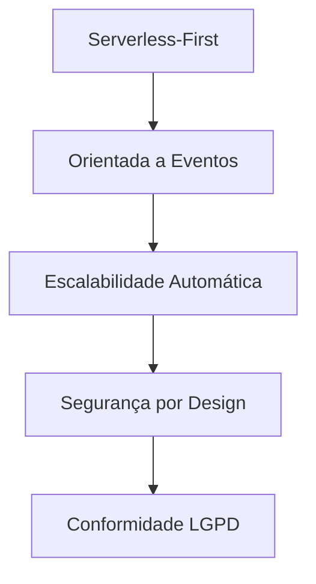
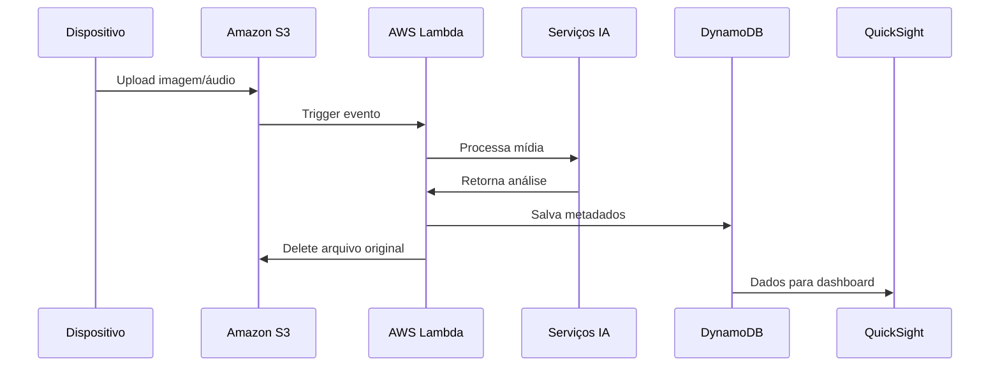

#  FaceFeeling

<div align="center">


**Sistema de Monitoramento de Satisfação e Reação do Cliente**

*Captura e análise inteligente de expressões faciais e áudio para otimização da experiência do cliente*

[](https://aws.amazon.com/)
[](https://python.org/)
[](https://aws.amazon.com/lambda/)
[](https://www.gov.br/cidadania/pt-br/acesso-a-informacao/lgpd)

</div>

---

## 📋 Índice

- [🎯 Visão Geral](#-visão-geral)
- [👥 Equipe](#-equipe)
- [🏗️ Arquitetura](#️-arquitetura)
- [🔧 Componentes](#-componentes)
- [📊 Fluxo de Dados](#-fluxo-de-dados)
- [⚙️ Requisitos](#️-requisitos)
- [🚀 MVP](#-mvp)
- [📈 Metodologia](#-metodologia)
- [🔐 Segurança e Privacidade](#-segurança-e-privacidade)
- [📈 Benefícios](#-benefícios)

---

## 🎯 Visão Geral

O **FaceFeeling** é um sistema inovador que utiliza Inteligência Artificial para capturar e analisar expressões faciais e áudio de clientes em ambientes de varejo de forma **totalmente anônima**. 

### 🎯 Objetivo
Gerar métricas precisas sobre a satisfação do cliente em relação a produtos específicos, fornecendo insights valiosos através de um dashboard analítico intuitivo.

### 🌟 Diferenciais
- ✅ **100% Anônimo** - Conformidade total com LGPD
- ⚡ **Tempo Real** - Processamento instantâneo com AWS
- 📊 **Insights Acionáveis** - Dashboard inteligente
- 🔄 **Escalável** - De 1 loja a centenas de estabelecimentos
- 💰 **Custo-efetivo** - Arquitetura Serverless

---

## 👥 Equipe

| Função | Nome |
|--------|------|
| 🏆 **Scrum Master** | Raquel da Silva Moura |
| 👩‍💻 **Líder Técnica** | Cibelli Cristina Souza Santos |
| 🏗️ **Arquitetos** | Leandro Eduardo Lima dos Santos<br>Samuel Cardoso do Nascimento |
| 💻 **Desenvolvedores** | Igor dos Santos Rocha<br>Vinícius Rosa da Costa<br>Alan Fabrício Barbosa da Silva |

---

## 🏗️ Arquitetura

### 🎨 Filosofia de Design



#### Princípios Fundamentais:
- 🔧 **Serverless-First**: Uso de serviços gerenciados AWS Lambda
- ⚡ **Event-Driven**: Sistema reativo baseado em eventos
- 📈 **Auto-Scaling**: Escalabilidade horizontal automática
- 🔒 **Security by Design**: Segurança integrada desde o início

### 🔄 Fluxo da Arquitetura

```
📱 Dispositivo de Captura 
    ↓
☁️ Amazon S3 
    ↓
⚡ Evento S3 Trigger 
    ↓
🔧 AWS Lambda 
    ↓
🤖 Serviços de IA (Rekognition, Transcribe, Comprehend) 
    ↓
🗄️ Amazon DynamoDB 
    ↓
📊 Amazon QuickSight Dashboard
```

---

## 🔧 Componentes

### 📸 Módulo de Captura
- **Hardware**: Raspberry Pi 4 + Câmera USB + Microfone USB
- **Software**: Python + boto3 (AWS SDK)
- **Funcionalidades**:
  - Captura automática a cada 10 segundos
  - Upload seguro via HTTPS
  - Detecção de atividade de voz (VAD)

### ⚡ Processamento (AWS Lambda)
```python
# Função: processCustomerReaction
# Runtime: Python 3.11
# Trigger: s3:ObjectCreated:*
```

### 🗄️ Banco de Dados (DynamoDB)
```json
{
  "TableName": "CustomerReactions",
  "PartitionKey": "ProductId",
  "SortKey": "Timestamp",
  "Attributes": {
    "EventId": "String",
    "StoreId": "String", 
    "DetectedEmotion": "String",
    "EmotionConfidence": "Number",
    "AgeRange": "Map",
    "VoiceSentiment": "String"
  }
}
```

### 📊 Serviços AWS Utilizados

| Serviço | Função |
|---------|---------|
| 🪣 **Amazon S3** | Armazenamento temporário seguro |
| ⚡ **AWS Lambda** | Orquestração serverless |
| 👁️ **Amazon Rekognition** | Análise de expressões faciais |
| 🎤 **Amazon Transcribe** | Conversão de voz para texto |
| 🧠 **Amazon Comprehend** | Análise de sentimento |
| 🗄️ **Amazon DynamoDB** | Banco NoSQL para metadados |
| 📊 **Amazon QuickSight** | Dashboards e BI |
| 🔐 **AWS IAM** | Gerenciamento de permissões |

---

## 📊 Fluxo de Dados



---

## ⚙️ Requisitos

### ✅ Funcionais
- 📸 Captura de expressões visuais e voz dos clientes
- 📊 Análise inteligente e identificação de padrões
- 📈 Geração de métricas para equipe de experiência

### 🔒 Não-Funcionais
- 🛡️ **Privacidade**: Garantia total de anonimização (LGPD)
- 🎨 **Usabilidade**: Interface intuitiva para análises
- 👁️ **Discrição**: Captura invisível ao cliente

---

## 🚀 MVP

### 🎯 Produto Mínimo Viável
- ✅ Captura de expressões faciais
- ✅ Relatórios básicos por produto
- ✅ Dashboard inicial para equipe

---

## 📈 Metodologia

### 🔄 Gestão Ágil
- **Framework**: Kanban
- **Ferramenta**: Trello
- **Foco**: Entrega contínua de valor

---

## 🔐 Segurança e Privacidade

### 🛡️ Conformidade LGPD
- ✅ **Anonimização Total**: Sem armazenamento de dados pessoais
- ✅ **Deleção Automática**: Arquivos originais removidos após processamento
- ✅ **TTL Configurado**: Expiração automática de dados após 1 ano
- ✅ **Criptografia**: Todos os dados em trânsito e em repouso

### 🔒 Medidas de Segurança
- 🎯 **IAM Roles**: Princípio do menor privilégio
- 🔐 **Encryption**: AES-256 para todos os dados
- 📝 **Audit Logs**: CloudWatch para monitoramento
- 🚨 **Alertas**: Notificações automáticas de anomalias

---

## 📈 Benefícios

### 💼 Para o Negócio
- 📊 **Insights em Tempo Real** sobre satisfação do cliente
- 💰 **ROI Mensurável** através de otimização de produtos
- 🎯 **Decisões Data-Driven** baseadas em dados concretos
- 📈 **Vantagem Competitiva** com tecnologia inovadora

### 🛠️ Para a Operação
- ⚡ **Zero Infraestrutura** para gerenciar
- 💰 **Custos Otimizados** com modelo serverless
- 📈 **Escalabilidade Automática** conforme demanda
- 🔧 **Manutenção Mínima** com serviços gerenciados

---

## 🎉 Conclusão

O **FaceFeeling** representa uma revolução na forma como as empresas compreendem e otimizam a experiência do cliente. Utilizando tecnologias de ponta da AWS e respeitando integralmente a privacidade dos usuários, oferecemos uma solução que transforma dados comportamentais em insights acionáveis.

**Resultado**: Satisfação do cliente cada vez mais alinhada às suas necessidades reais.

---

<div align="center">

### 🚀 Pronto para transformar a experiência dos seus clientes?

**Entre em contato com nossa equipe!**

[](https://aws.amazon.com/)
[](https://python.org/)

</div>
